# iOS - Swift Study

## 개요

iOS 및 Swift 관련 Study 내용입니다.

## 기간

2020년 1월 24일 ~ 2020년 1월 27일 ( 설 명절 😀)

## 목차

[DAY01 학습내용](#DAY01-학습내용)

[DAY02 학습내용](#DAY02-학습내용)

[DAY03 학습내용](#DAY03-학습내용)

[DAY04 학습내용](#DAY04-학습내용)

## DAY01 학습내용

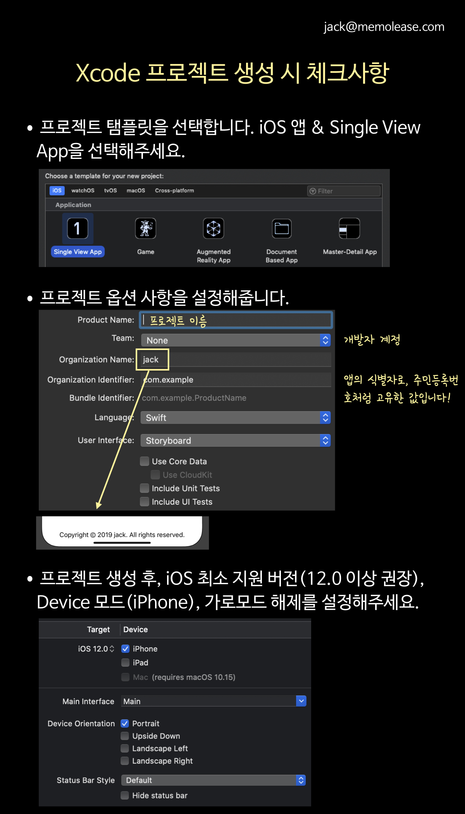

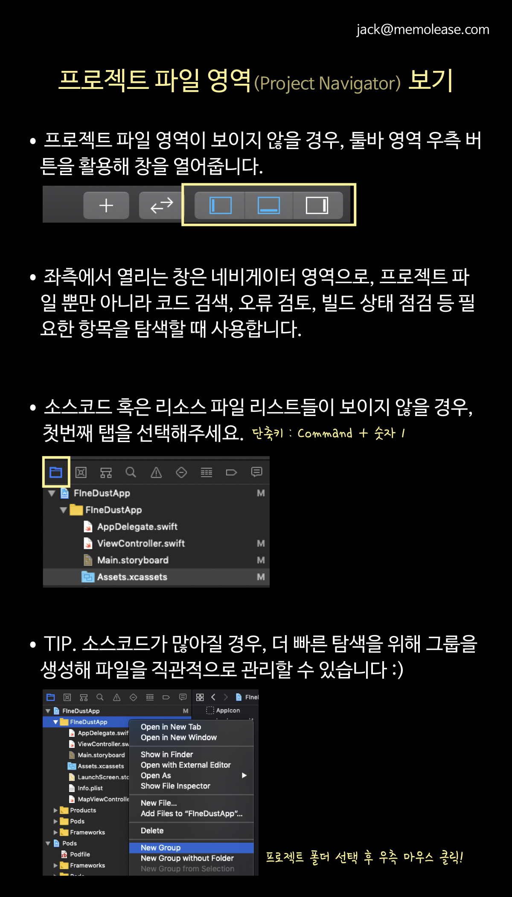

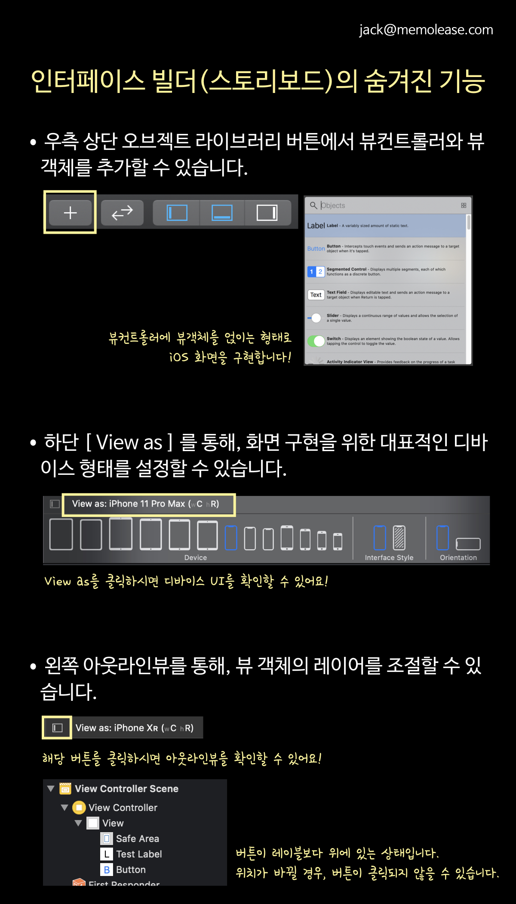

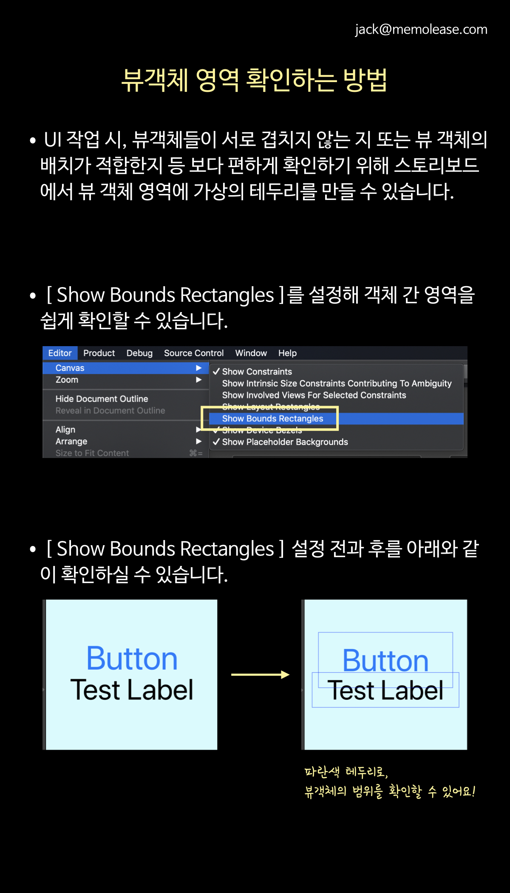

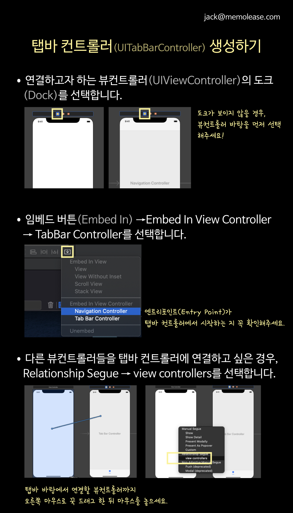

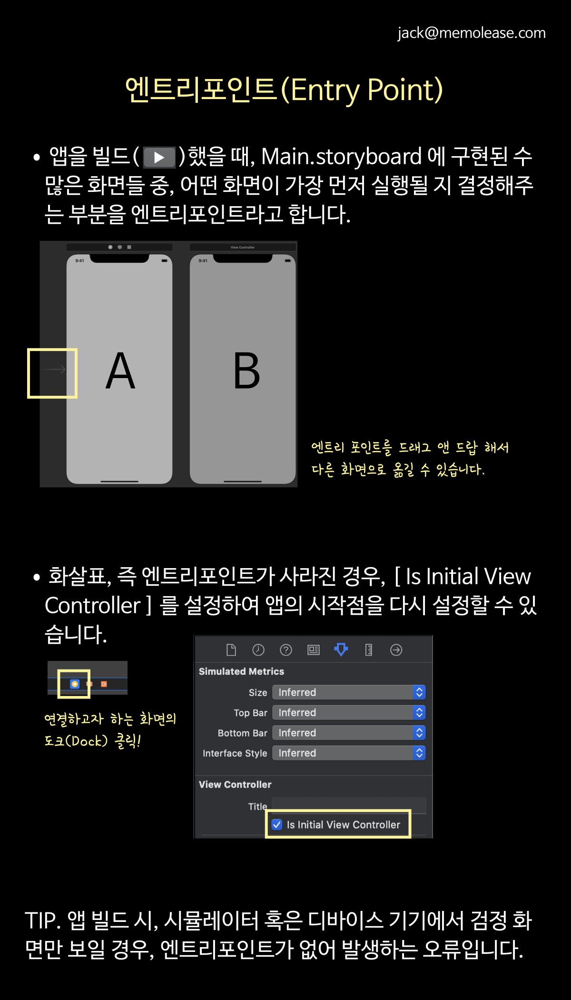

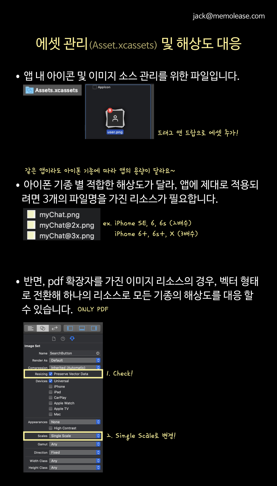

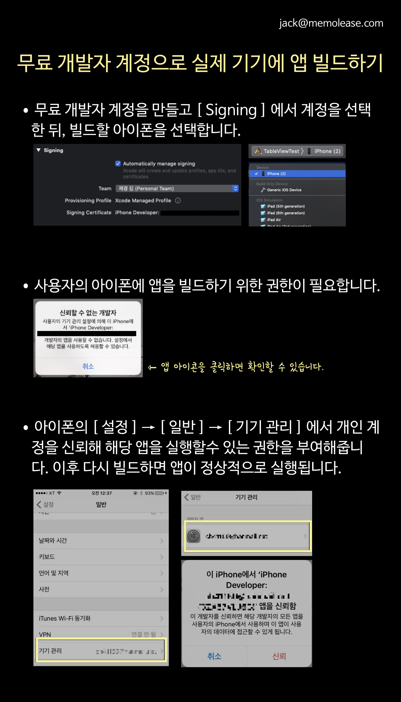

 

__< iOS 구조 >__

- CocoaTouch - Foundation(문법), UIKit(화면), ... <- 제일 많이 사용되는 파트

- Media - 사진, 영상, 음악, 파일 ,카메라, ...

- CoreService - 센서, GPS, ...

- CoreOS - 하드웨어, 네트워크, 전원, 배터리와 같은 하드웨어와 관련된 기능 담당

__<추가적으로 공부해야될 내용>__

1. segue(세그웨이) 란?

## DAY02 학습내용

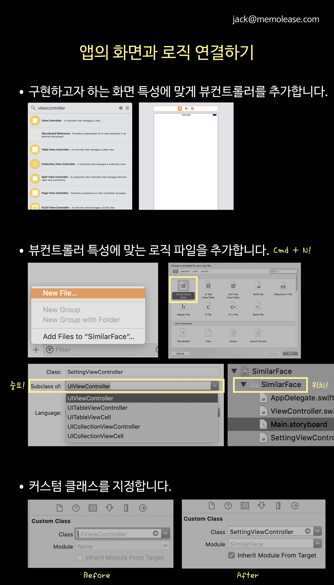

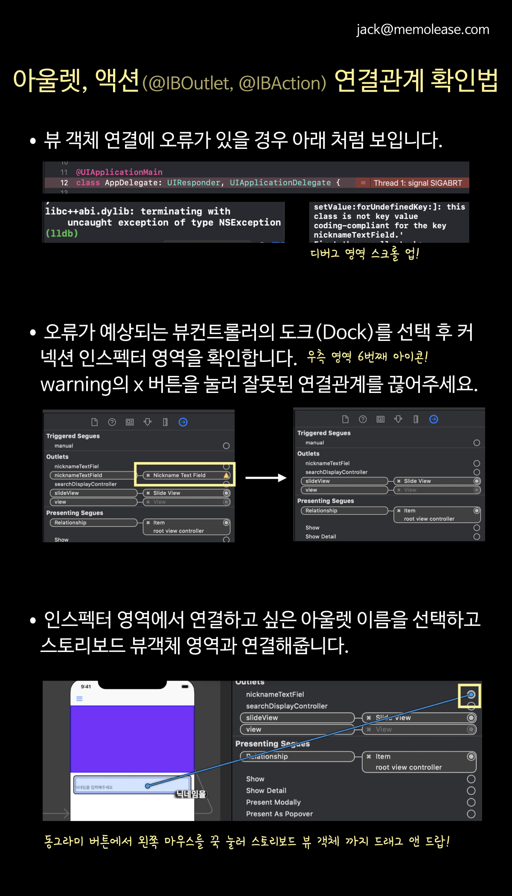

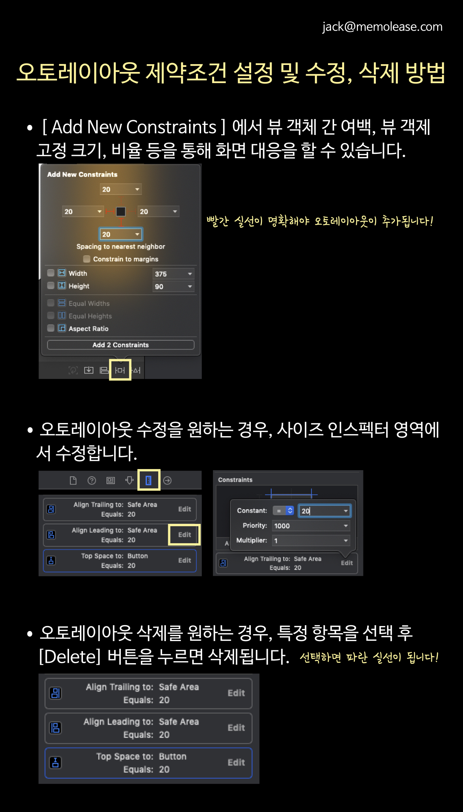

 

iOS에서 스토리보드의 View를 소스코드나 헤더에 등록하게 되면 @IBOutlet 형식으로 등록하게 된다.

여기서 IBO는 Interface Builder Outlet의 의미를 가진다.

__<추가적으로 공부해야될 내용>__

1. outlet의 정의 확실히 하기? -> 스토리보드의 UIView 요소를 코드에서 매칭하는 것을 의미
2. outlet에서 weak과 strong의 의미
3. iOS에서의 화면 생성주기 파악
4. View 객체에 대해서 더 공부

## DAY03 학습내용

## DAY04 학습내용
